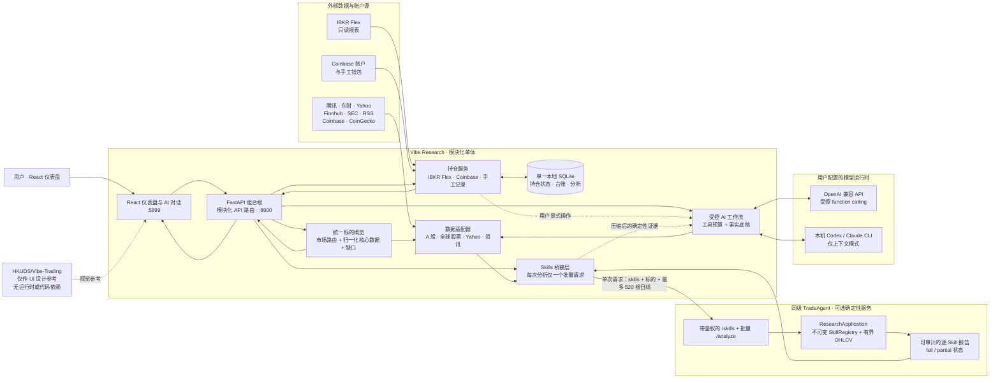

<p align="center"><b>简体中文</b> | <a href="README_en.md">English</a></p>

<h1 align="center">Vibe-Research · 个人 AI 投研系统（股票 / 加密货币）</h1>

[](LICENSE)
[](https://www.python.org/)
[](https://react.dev/)
[](https://fastapi.tiangolo.com/)
[](https://github.com/simonlin1212/Vibe-Research/stargazers)
[](https://viberesearch.wiki)
[](README_en.md)

<p align="center">
  <a href="https://viberesearch.wiki">官网</a> ·
  <a href="#产品预览">产品预览</a> ·
  <a href="#功能">功能</a> ·
  <a href="#数据源data-sources">数据源</a> ·
  <a href="#快速开始">快速开始</a> ·
  <a href="#接入-ai">接入 AI</a> ·
  <a href="#合规">合规</a> ·
  <a href="#相关生态">相关生态</a>
</p>

> **Vibe-Research: Your Personal Trading Research Agent** · A股 / 美股 / 欧洲股 / 港股 / 加密货币的个人投研 Agent。
>
> 每日复盘、资讯雷达、个股数据、自选股、板块中心、我的持仓、我的研报、研究记录。把数据和功能配齐，由**你自己的 AI** 驱动投资研究。

Vibe-Research 是一个开源、自托管的「个人 AI 投研看板」，覆盖 A 股、美股、欧洲股、港股与加密货币。它不替你做决定——把行情、研报、估值、财务、公告、资金面、资讯、真实持仓和组合分析放进一个干净的看板，再通过受控工作流接入**你自己的 AI**。方向和结论，交给你自己配置的模型 / agent。

> *Vibe-Research: Your Personal Trading Research Agent. A self-hosted dashboard for stocks and crypto with controlled access to **your own AI / agent** — it never recommends a trade. You bring the model, it brings the data.*

## 产品预览

**每日复盘** — 大盘 / 短线情绪(连板股 · 成交额 TOP20) / 板块资金一屏看全，一键交给你的 AI 复盘


<table>
<tr>
<td width="50%">

**个股数据** — 财报速览 + 估值分位 + 资金面一屏看穿


</td>
<td width="50%">

**资讯雷达** — 12 赛道 108 个公开源，一键提炼今日要点


</td>
</tr>
</table>

---

## 功能

每个页面的具体模块：

| 页面 | 包含的模块 / 能力 |
|---|---|
| 📊&nbsp;**每&#8288;日&#8288;复&#8288;盘** | 大盘指数 · **全球市场**（隔夜美股道指 / 标普 / 纳指 + 港股恒指 / 恒生科技）· 关注股票（自选实时行情）· **短线情绪**（连板股 / 最高连板 / 连板梯队 / 封板率 / 炸板率 / 晋级率）· **全市场成交额 TOP20** · 市场情绪（大盘宽度 / 题材投机 / 涨跌停）· 板块资金趋势榜 · 资金轮动 · AI 当日复盘 |
| 📡&nbsp;**资&#8288;讯&#8288;雷&#8288;达** | 12 赛道 108 个公开 RSS 源 · AI 一键提炼「今日要点」· A 股公告 / 公开新闻（挂钩你的关注列表）|
| 🔍&nbsp;**标&#8288;的&#8288;数&#8288;据** | **A 股**：行情 · 估值 · 财报 · 研报 · 公告 · 新闻 · 资金面等完整数据。**美股 / 欧洲股 / 港股 / 韩股**：交易所感知的 Yahoo/公开行情与关键财务。价格图优先展示；美股可运行 SEC Company Facts 基本面与 filings 技能，另有股票专用 `worth-buy-stocks`，以及股票 / 加密货币共用的价格序列技能。|
| ⚔️&nbsp;**多&#8288;视&#8288;角&#8288;研&#8288;究** | 两种受控模式：① **多空辩论**（多方 / 空方 / 可选反驳 / 中立主持）；② **研究团队**（基本面、市场结构、事件风险三位专项研究员 + 中立负责人）。所有角色共享同一份客观底稿，刻意不产出交易指令。可同时粘贴多条笔记或上传多个 TXT / Markdown / 文字型 PDF；材料只在本次运行中使用、不会持久化。研究团队还可显式选择**单个 IBKR 开放持仓**，并通过独立开关决定是否附带组合层面的目标 / 风险偏好。|
| ⭐&nbsp;**自&#8288;选&#8288;股** | **批量粘贴一串代码即加**（逗号 / 空格 / 换行都行）· 一屏表格总览（现价 / 涨跌 / PE / PB / 换手）· **实时行情开关**（右上角，默认关；开了在交易时段每 3 秒自动刷新，非交易时段与页面切走时自动暂停）· 一键交给 AI 读。只存本地 |
| 🧩&nbsp;**板&#8288;块&#8288;中&#8288;心** | 板块 + 产业链环节骨架 |
| 💼&nbsp;**我&#8288;的&#8288;持&#8288;仓** | 股票 / 加密货币 / 现金总览 · **IBKR Flex 只读同步** · 仓位分配 · 资金流调整回报与最大回撤 · P&L 日历 · 最新盈亏贡献者 · broker reconciliation · 自动交易账本 · 单仓 K 线深挖（成本线、买卖点、交易所感知代码）· Coinbase 只读余额与手工加密钱包 · 持久化投资目标 / 风险偏好。原有手工持仓和清仓记录保留在独立视图。|
| 📄&nbsp;**我&#8288;的&#8288;研&#8288;报** | **拖拽 / 多选上传**自己的研报（PDF / Word / txt / 表格 / 图片）· 按文件名**自动分行业**归档 · 下载 / 删除。**只存本地部署目录、不上传、不进仓库** |
| 📝&nbsp;**研&#8288;究&#8288;记&#8288;录** | 复盘 / 今日要点 / 问 AI / 辩论与研究团队结果本地沉淀，随时回看 · **反思审计**：让 AI 回头审这段推理——哪些结论有数据撑着、哪些是脑补、最脆弱的一环在哪、要验证得看什么 |
| 🔌&nbsp;**接&#8288;入&nbsp;AI** | 统一的受控 AI 层：每个入口声明工作流、启动提示词、只读工具白名单和调用预算 · 订阅接入（本机 CLI，context-only）· API 多模型（受控 function-calling）· MCP（给外部 agent）· 对话按页面 / 标的隔离并持久化。|

全站为响应式布局：手机端使用可展开侧栏，桌面端可完全隐藏侧栏扩大分析画布。自托管到 NAS 时可启用单用户登录、HttpOnly 会话和登录限流。

> **投研分析框架**：让 AI 分析个股时，自动按 估值 / 资金面 / 财报质量 / 行业景气 / 事件催化与风险 五维组织结论——框架只规定「怎么读数据」、不规定买卖，方向仍由你自己的 AI 决定。
>
> 连板股 / 成交额榜等均为**客观公开榜单数据，只呈现事实、不推荐、不预测**。

## 数据源（Data Sources）

Vibe-Research 把三套公开数据源**直接集成进仓库**——`git clone` 下来**开箱即用，无需另外下载、接线**。

### A 股全栈数据 · AStockData

- **就在本仓库的 [`a-stock-data/`](a-stock-data/) 文件夹里**（v3.6.0）。十层数据架构、47 个端点、15 个数据源，`a-stock-data/SKILL.md` **内嵌全部调用代码**，自包含、零第三方数据封装依赖，东财接口已内置限流防封，主源被封还能降级到备用源。
- **覆盖**：行情 / K线 / 研报 / 一致预期 / 估值 / 历史分位 / 财务三表 / 公告 / 龙虎榜 / 融资融券 / 大宗交易 / 股东户数 / 分红 / 资金流 / 解禁 / 概念板块 / 打板情绪 / ETF 期权 / 互动易 / 全市场行业排名 …
- **给 agent 用**：用 Claude Code 等 agent 跑本仓库时，要调 A 股数据就看 [`a-stock-data/SKILL.md`](a-stock-data/SKILL.md)——每个接口都有 copy-paste 即用的代码。Vibe-Research 后端的数据层（`backend/astock.py`）也是从它移植的。
- **运行依赖**：`pip install mootdx requests pandas stockstats`（自包含，v3.0 起已移除 akshare 依赖）。
- **更新 / 上游**：<https://github.com/simonlin1212/a-stock-data> —— 想跟进最新端点、扩数据源，去这里看；**但即便你不更新，仓库自带的这份也是固定可用的快照，可以一直用。**

### 美股 / 港股数据 · global-stock-data

- **就在本仓库的 [`global-stock-data/`](global-stock-data/) 文件夹里**（v2.0.3）。13 层数据架构、30+ 个端点、11 个数据源、零鉴权，覆盖美港股行情 / K线 / 技术指标 / 三表财报 / 资金流 / 期权（CBOE 官方期权链含完整希腊字母与 0DTE 流）/ FINRA 空头成交量 / SEC EDGAR 申报流与全市场筛选。每个数据源都标注了合规级别。
- 后端 `backend/gstock.py` 移植了**东财域内的合规子集**：全球指数（每日复盘「全球市场」栏）+ 美港股个股行情 & 关键财务指标（个股页输 `AAPL` / `00700` 即用）。东财调用复用 `astock.em_get`（直连优先，避开科学上网代理挂国内站）。
- **韩股**：东财已覆盖，个股页输 6 位代码**加 `.KS` 后缀**即可（如三星 `005930.KS`、SK 海力士 `000660.KS`）。⚠️ 韩股代码与 A 股同为 6 位数字，**必须带 `.KS` 后缀**才能被识别为韩股（否则按 A 股处理）；东财对韩股仅给行情、无财务。台股走美股 ADR（如台积电 `TSM`）。
- **上游**：<https://github.com/simonlin1212/global-stock-data> —— 想要 K线 / 技术指标 / 期权 / SEC 等全量端点，去这里看。

### 全球资讯 · investment-news

- 12 赛道 108 个公开 RSS 源，已并入 `backend/newsradar.py` + `backend/news_sources.json`：纯标准库、零 key、已按合规词表过滤（剔除赌 / 预测市场 / 加密等）。
- **上游**：<https://github.com/simonlin1212/investment-news>

### 美股基本面、监管文件与公司新闻

- **SEC EDGAR**：TradeAgent 的 `fundamental` 与 `filings` 使用 typed Company Facts、submissions 和 filed-date provenance。设置 `VR_SEC_USER_AGENT`；使用 Compose 时还需设置 `TRADE_RESEARCH_FUNDAMENTAL_PROVIDER=sec_company_facts`（本地一键脚本会自动选择）。技能目录会明确报告未配置的 provider capability，而不会把它显示为可运行。
- **公司新闻**：配置 `VR_FINNHUB_API_KEY` 时优先使用 Finnhub；未配置或短暂失败时使用从 Vibe-Trading 数据工具模式复用的 Yahoo Search 备用适配器。响应会标明实际 provider、抓取时间、降级缺口和 stale 状态。
- Yahoo Search 是无 key 的 best-effort 备用源，不承诺完整覆盖；Finnhub earnings 仍是独立可选能力，不会被新闻备用源替代。

> 数据均来自公开源。Vibe-Research 只做客观信息整理与公开榜单呈现（连板股 / 成交额榜等，与东财 / 同花顺同款客观数据），**只呈现事实、不推荐个股、不预测涨跌、不给买卖时机、不做主观评分**；用这些数据做什么分析、看什么方向，由你和你自己的 AI 决定。

## 架构

应用采用**模块化单体**：一个 React 客户端、一个 FastAPI 进程、一个本地 SQLite
数据库，以及一个可选的确定性分析服务。这样既保持本地部署简单，也保留清晰的模块边界。

```
Vibe-Research/
├── a-stock-data/      A 股全栈数据工具箱（数据源，v3.6.0，自带即用）
├── global-stock-data/ 美股 / 港股数据工具箱（数据源，v2.0.3，自带即用）
├── backend/           FastAPI :8900
│   ├── app.py           仅负责组合、中间件和健康检查
│   ├── api/             按产品关注点分组的路由
│   ├── instrument_overview.py  统一标的读模型
│   ├── astock.py        A 股数据（移植自 a-stock-data）
│   ├── gstock.py        美股 / 港股数据（移植自 global-stock-data）
│   ├── newsradar.py     资讯雷达（移植自 investment-news）
│   ├── market.py        市场情绪 + 板块资金流 + 全球指数
│   ├── position_store.py 共享 SQLite 持仓状态存储
│   ├── portfolio.py     手工持仓与已清仓
│   ├── ibkr_*.py        IBKR Flex 导入、分析账本与交易点位
│   ├── crypto_*.py      Coinbase / 手工钱包与跨资产汇总
│   ├── auth.py          可选单用户登录与可撤销 HttpOnly 会话
│   ├── tools.py         统一只读 AI 工具注册表
│   ├── ai_workflows.py  工作流提示词、工具白名单与轮次预算
│   ├── chat.py          受控 AI 运行时（OpenAI 兼容 function-calling / CLI）
│   ├── debate.py        多空辩论编排（事实底稿 → 多方 / 空方 / 中立主持）
│   ├── research_team.py 研究团队编排（3 位专项研究员 → 中立负责人）
│   ├── research_context.py  多份临时 TXT / MD / PDF 上下文提取与边界校验
│   ├── reflection.py    反思审计（对已有分析做推理审计）
│   └── mcp_server.py    MCP server（给 Claude Code 等 agent）
└── frontend/          Vite + React 19 + TS + Tailwind（玻璃暖橙主题）:5899
```

### 运行时架构与 TradeAgent 边界



| 关注点 | 责任归属与数据流 |
|---|---|
| 数据源 | Vibe 适配器读取数据；`instrument_overview.py` 统一负责市场路由，返回归一化核心数据、能力和显式缺口，React 不再编码供应商规则。短时行情缓存减少重复请求，短暂故障时可返回上次成功值。 |
| AI 对话 | Vibe 维护单一英文标准提示词，限制只读工具和轮次，并构建事实底稿。语言选择仅作为输出指令/翻译层，不维护第二套提示词。 |
| 分析仪表盘 | React 使用类型化 API。标的页仅发起一个可取消的核心请求并立即渲染，然后再加载新闻、业绩日历和公告，不阻塞图表。 |
| 持仓 | Vibe 只读导入 IBKR Flex 和 Coinbase，并合并可选手工记录。可变持仓状态、交易台账和分析共用一个 SQLite 数据库；旧 JSON 仅一次导入。持仓只在用户显式操作后进入 AI 上下文，绝不发给 TradeAgent。 |
| Skills | Vibe 只准备一次标的和 OHLCV，并通过单个 `/analyze` 请求发送全部选中 Skills。TradeAgent 校验有界载荷并返回可审计的 full / partial 报告；它不负责经纪商、订单、持仓或 LLM。 |

依赖方向刻意保持单向：**Vibe Research 可以调用 TradeAgent，但
TradeAgent 不会回调 Vibe Research**。因此，可复用的分析引擎与产品 UI、
个人数据、经纪商连接和模型供应商保持解耦。AI 工作流可以引用经压缩的
Skill 结果作为证据，但无法修改 Skill 计算，也无法提交订单。名称相似的
`HKUDS/Vibe-Trading` 并不是这个同级服务：Vibe Research 只参考其视觉语言，
没有导入或调用它。

这是系统刻意保留的唯一额外进程。如果现在就把数据适配器、持仓、AI 工作流或路由拆成多个服务，
只会增加部署、网络和一致性成本。当前模块边界已提供长期扩展点；只有当独立扩容或独立部署成为可测量需求时，
才应抽取新服务。

**分级依赖**：行情（腾讯）+ 研报 / 公告（东财）**秒装可用**；akshare / mootdx 惰性导入，缺失时对应端点返回 501 + 安装提示，不拖垮服务。

## 快速开始

### 方式 A：本地一键启动（推荐开发 / 测试）

前置条件：Vibe Research 和 [TradeAgent](../TradeAgent) 目录并列，且各自已经创建 `.venv` / 安装依赖。TradeAgent 负责 `worth-buy-stocks`、`markov-method`、`technical-basic`、`risk-analysis` 与 `volatility-regime` 等只读确定性分析；IBKR 持仓与组合分析已经完全内置在 Vibe，**不需要 PA Master**。首次安装仍可按下面的命令完成：

```bash
cd /Users/chenkangan/Documents/VibeResearch

# Vibe 后端依赖
python3 -m venv backend/.venv
backend/.venv/bin/pip install -r backend/requirements.txt

# Vibe 前端依赖
cd frontend && npm install && cd ..
```

启动完整本地栈（TradeAgent、Vibe 后端和前端）：

```bash
cd /Users/chenkangan/Documents/VibeResearch
bash scripts/start-local-stack.sh
```

打开 <http://127.0.0.1:5899>。脚本只启动 TradeAgent、Vibe 后端和 Vibe 前端；不会启动或调用 PA Master。脚本在前台运行，按 `Ctrl-C` 会停止它启动的全部服务；日志会保留在脚本输出的临时目录中。

### TradeAgent Skills

Vibe 只负责标的选择、行情归一化、AI 入口和报告展示；确定性分析由同级目录的 TradeAgent 执行。价格类技能通过严格的 instrument contract（`symbol` + `market`）接收最多 520 根日线 OHLCV；美股基本面与 filings 技能复用 TradeAgent 已有的 typed SEC providers，不把 provider payload 复制进 UI bridge。股票行情沿用现有 Yahoo / A 股数据路径，加密货币日线由 Coinbase 提供，成交量保留小数。

| Skill | 股票 | 加密货币 | 输入 / 输出重点 |
|---|---:|---:|---|
| `fundamental` | ✓（美股） | — | SEC point-in-time 增长、利润率、现金流、杠杆和可用估值因子 |
| `filings` | ✓（美股） | — | SEC 申报数量、8-K 活跃度与 10-K / 10-Q 时效 |
| `worth-buy-stocks` | ✓ | — | 趋势、相对强度、风险否决与参考价位 |
| `markov-method` | ✓ | ✓ | Bull / Bear / Sideways 状态、转移矩阵与稳态分布 |
| `technical-basic` | ✓ | ✓ | EMA、ADX/DMI、RSI、布林带、OBV 与量能确认；要求完整 OHLCV |
| `risk-analysis` | ✓ | ✓ | 波动率、下行偏差、最大回撤、历史 VaR/CVaR 与收益分布形状 |
| `volatility-regime` | ✓ | ✓ | 20 日实现波动率、历史百分位与扩张 / 收缩状态 |
| `backtesting` | ✓ | ✓ | 日线 long/flat SMA、MACD、RSI 与 Markov 回测、交易点、权益曲线和绩效指标 |

`/backtesting` 回测实验室提供独立的参数与图表界面；该技能不会出现在标的数据页的通用技能选择器中。技能卡片、表格、图表坐标和 tooltip 统一显示两位小数；折叠的 Raw JSON 保留原始精度，便于审计。若数据字段或历史长度不足，界面会展示 TradeAgent 返回的 partial 状态，不会静默伪造结果。

要在本地运行时使用真实持仓，可在仓库根目录创建被 Git 忽略的 `.env.local`（推荐，优先于 `.env`）：

```bash
export VR_IBKR_FLEX_TOKEN='your_flex_token'
export VR_IBKR_FLEX_QUERY_ID='your_positions_query_id'
export VR_IBKR_FLEX_HISTORY_QUERY_ID='your_history_query_id'
export VR_IBKR_FLEX_TIMEZONE='Europe/London'
export VR_IBKR_FLEX_COOLDOWN_SECONDS='300'
export VR_IBKR_FLEX_INTER_QUERY_DELAY_SECONDS='5'
```

如果你已经有根目录 `.env`，也可以直接把这几个变量加入现有 `.env`；本地脚本在找不到 `.env.local` 时会自动读取 `.env`，Docker Compose 也使用同一个文件。

然后重新运行 `bash scripts/start-local-stack.sh`；脚本会自动读取 `.env.local`，不存在时回退到 `.env`。

当 current token/query 同时存在时，脚本会将凭据传给 Vibe 的「我的持仓」直接 IBKR 面板。history query 可选；配置后「刷新当前 + 历史」会先导入当前持仓，默认间隔 5 秒再导入历史 P&L。若 IBKR 返回正在生成（1001/1019）或 pacing（1018），Vibe 会分别使用 15 秒或 60 秒退避并只重试一次；因此正常刷新不再固定等待一分钟。

`VR_IBKR_FLEX_QUERY_ID` 应指向包含 `OpenPosition`、账户信息、成本、标记价格、持仓价值和未实现盈亏的 current query。`VR_IBKR_FLEX_HISTORY_QUERY_ID` 应指向包含 `ChangeInNAV`、`MTMPerformanceSummaryUnderlying`、`Trade` 和 `SecurityInfo` 的历史 query。`SymbolSummary` 不是逐日 MTM 数据，不能替代 `MTMPerformanceSummaryUnderlying`。

本地脚本默认将持仓快照和分析账本持久化到 `~/.vibe-research`。即使脚本回退读取 Docker 使用的 `.env`，也不会误用容器内的 `/data` 路径；需要自定义时设置 `VIBE_LOCAL_DATA_DIR`。

停止本地栈后再切换到 Docker：

```bash
# 在运行脚本的终端按 Ctrl-C
```

### 方式 B：Docker Compose（NAS / 长期运行）

安装并启动 Docker Desktop（或 NAS 上的 Docker Engine）后，在仓库根目录创建 `.env`。不要把 token 放进前端变量或提交到 Git：

```env
VR_IBKR_FLEX_TOKEN=your_flex_token
VR_IBKR_FLEX_QUERY_ID=your_positions_query_id
VR_IBKR_FLEX_HISTORY_QUERY_ID=your_history_query_id
VR_IBKR_FLEX_BASE_URL=https://ndcdyn.interactivebrokers.com/AccountManagement/FlexWebService
VR_IBKR_FLEX_TIMEZONE=Europe/London
VR_IBKR_FLEX_COOLDOWN_SECONDS=300
VR_IBKR_FLEX_INTER_QUERY_DELAY_SECONDS=5
VR_BIND_ADDRESS=127.0.0.1
VR_WEB_PORT=8080
```

启动或更新服务：

```bash
cd /Users/chenkangan/Documents/VibeResearch
docker compose up -d --build backend frontend
```

打开 <http://127.0.0.1:8080>，进入「我的持仓」并点击「刷新当前 + 历史」。快照和分析账本持久化在 Compose 的 `vibe-data` volume 中；NAS 部署可用 `VR_DATA_PATH` 指向 NAS 的绝对目录。

如果要启用 TradeAgent 的 Compose research profile：

```bash
# 首次使用或 TradeAgent 代码有更新时，先构建镜像
docker build -t trade-research:latest ../TradeAgent

# .env 中同时设置：
# VR_TRADE_RESEARCH_ENABLED=true
# VR_TRADE_RESEARCH_API_TOKEN=一个随机共享密钥
# VR_SEC_USER_AGENT=VibeResearch/0.3 your-email@example.com
# TRADE_RESEARCH_FUNDAMENTAL_PROVIDER=sec_company_facts
COMPOSE_PROFILES=research docker compose up -d --build
```

Compose 中的 `research-api` 使用同一个 `VR_TRADE_RESEARCH_API_TOKEN` 与 Vibe 后端通信。

常用运维命令：

```bash
docker compose ps
docker compose logs -f backend
docker compose down
```

不要同时运行本地脚本和 Docker Compose；两者会争用端口。Docker 不运行时，使用本地脚本完全可以工作。

### 手机 / 局域网访问

一键脚本默认只监听 `127.0.0.1`。要用手机测试，停止一键脚本，按下方「手动启动单个服务」启动后端，并把前端命令中的 host 改为：

```bash
cd frontend && npm run dev -- --host 0.0.0.0 --port 5899
```

在 Mac 上运行 `ipconfig getifaddr en0` 取得 Wi-Fi IP，然后在同一 Wi-Fi 的 iPhone Safari / Chrome 打开：

```text
http://<Mac 的局域网 IP>:5899
```

例如 `http://192.168.1.128:5899/portfolio`。若无法打开，检查 macOS 防火墙是否允许 Node/Vite 入站，并确认没有开启会隔离局域网设备的访客 Wi-Fi 或 VPN。局域网 HTTP 仅用于测试；跨网络 / NAS 使用应通过 HTTPS 反向代理或 Tailscale Serve，并启用下面的登录层。

### NAS / 远程访问登录保护

公网或跨网络部署时，在 `.env` 中启用单用户认证：

```bash
# 交互式生成 Argon2id 哈希
docker compose run --rm backend python auth.py hash-password
```

```env
VR_AUTH_ENABLED=true
VR_AUTH_USERNAME=admin
VR_AUTH_PASSWORD_HASH='$argon2id$...'
VR_AUTH_COOKIE_SECURE=true
VR_PUBLIC_ORIGIN=https://research.example.com
```

哈希必须用单引号包住，避免 `$` 被 Compose 插值。`VR_AUTH_COOKIE_SECURE=true` 只用于 HTTPS；纯 HTTP 局域网测试保持 `false`。不要直接暴露后端 `8900`、TradeAgent 或数据库端口。更完整的密码重置与会话说明见 [`backend/README.md`](backend/README.md)。

### IBKR Flex 配置要点

在 IBKR Client Portal 的 **Reporting → Flex Queries** 中启用 Flex Web Service、创建 current 与 history 两个 Activity Flex Query，并复制 token 和 query ID。Vibe 使用 `VR_IBKR_FLEX_QUERY_ID` 导入当前持仓，使用可选的 `VR_IBKR_FLEX_HISTORY_QUERY_ID` 导入 YTD NAV/MTM 历史。完整说明见 [`backend/README.md`](backend/README.md) 的「真实持仓与浏览器登录」章节。

本地启动时，脚本会打印本次日志目录和一条可直接复制的 IBKR 日志命令，例如：

```bash
tail -f /path/printed/by/script/vibe-backend.log
```

日志只记录请求阶段、HTTP 状态、响应类型/大小、不可逆指纹和重试次数；不会记录 Flex token、query ID、账户 ID 或原始报表。常见错误：`1001` 表示 IBKR 暂时无法生成 statement，应用会按退避间隔重试并保留旧快照；`1018` 表示 pacing limit，应等待冷却时间后再试。

如需在不写入 Vibe 快照的情况下单独检查 Flex Query，先停止当前刷新任务，然后运行：

```bash
bash scripts/test-ibkr-flex.sh current
bash scripts/test-ibkr-flex.sh history

# 或一次检查两个；脚本会自动等待 Flex pacing 间隔
bash scripts/test-ibkr-flex.sh all
```

输出只包含报表 section 数量、日期和脱敏的响应结构。`current` 应有 `OpenPosition`；`history` 应有 `ChangeInNAV`、`MTMPerformanceSummaryUnderlying` 和 `Trade`。

### 手动启动单个服务（不启动完整栈）

需要时也可以分别启动后端和前端；先在两个终端都执行 `source .env.local`（没有 IBKR 时可跳过）：

```bash
# 终端 1
cd backend && .venv/bin/python -m uvicorn app:app --host 127.0.0.1 --port 8900
# 终端 2
cd frontend && npm run dev -- --host 127.0.0.1 --port 5899
```

## 接入 AI

在「接入 AI」页配置一次，全站的「问 AI / 复盘 / 今日要点」就都用你自己的模型。**分析都由你的模型给出，本产品不校准、无倾向。** 每个入口会先选择一个明确工作流（个股、组合、复盘、资讯、自选或板块），工作流决定启动提示词、只读工具白名单与最大调用轮次；模型不能越权调用其他 Vibe 工具。三种接入方式：

### 1. 订阅接入（调本机已登录的 CLI，免 API key）

用你自己的**订阅额度**，不用付 API 费。已支持：**Claude Code · Codex · Qwen Code · DeepSeek CLI**。

- **前提**：① 后端跑在你本机（云端读不到你本机 CLI）；② 对应 CLI 已安装并登录，命令在 `PATH` 上。例如：
  - Claude Code：`npm i -g @anthropic-ai/claude-code` → `claude`（用 Claude 订阅登录）
  - Codex：装 OpenAI Codex CLI → `codex login`（用 ChatGPT 订阅）
  - Qwen / DeepSeek：装各自 CLI 并登录
- 在「接入 AI 页 → 订阅接入」选一个即可，**无需填 key**。
- 原理：后端 `cli_runtime.py` 检测本机命令并 `spawn` 它一次性作答（数据已在提示词里）。⚠️ CLI 不做多轮工具调用，适合「复盘 / 今日要点 / 个股页问 AI」这类**数据已备好**的场景；要 AI 自己现场调数据工具的自由问答，用下面的「API 接入」。

### 2. API 接入（填自己的 key）

「接入 AI 页 → API 接入」选一个模型，**baseURL 自动填好**，只需粘 key。内置 **DeepSeek / 豆包 / MiniMax / OpenAI / OpenRouter / Groq / Together / MiMo / 任意 OpenAI 兼容端点**。这条支持 function-calling——AI 只能从当前工作流允许的行情、估值、研报或事件工具中按需取数。key 只存你本地浏览器、随请求发给你自己的后端、不上传、不进仓库。

> 当前没有通用网页搜索，也没有连接私有知识库。AI 抽屉会明确显示「受控 Vibe 数据工具」或「仅页面上下文」。以后接入 Web Search / Obsidian 时，应先实现独立的只读工具，再只给需要它的工作流加入白名单；不要把新能力默认开放给所有入口。

### 3. MCP（给 Claude Code / 高手 agent）

把后端挂成 MCP server，agent 用自己的订阅额度调 Vibe-Research 的数据工具、多步分析。命令见 [`backend/README.md`](backend/README.md)。要更全量的 A 股数据端点，用根目录 [`a-stock-data/`](a-stock-data/SKILL.md) 工具箱。

## 多 agent 是怎么设计的

开源的多 agent 金融框架（TradingAgents、ai-hedge-fund 等）流程末端都有一个 trader /
portfolio_manager 角色，产出「买 / 卖 / 仓位多少」。**本项目刻意不做那一层。**

页面提供两个从小做起、共享安全边界的多 agent 工作流。

### 研究团队

```
① 事实底稿      后端固定拉取一次客观数据
② 三位专项角色  基本面 / 市场结构 / 事件风险分别独立检查
③ 中立负责人    合并证据、冲突、数据缺口与下一步验证清单
```

研究团队可选一个开放的 IBKR 持仓作为上下文。发送前界面会明确预览交易所感知代码、数量、成本、标记价、未实现盈亏、NAV 占比和快照日期；不会顺带发送其他持仓。投资目标和风险偏好有单独开关，默认不发送，只有在它们确实与单仓分析相关时才勾选。

多空辩论与研究团队还可显式多选获准的 TradeAgent 技能，也可按股票 / 加密货币分别把当前选择保存为默认。默认技能只会在下次运行前预先勾选，仍可临时取消或增加；未选择的技能不会运行。默认设置持久化在 `VR_DATA_DIR`，重启或换设备访问同一部署仍然有效。Vibe 会复用一次行情准备、每个选中技能只计算一次，再把完全相同的只读结果加入共享底稿；例如 `technical-basic` 可成为多方和空方共同引用的技术指标证据。普通 API 模型的受控 AI 工作流也可按需调用 `run_research_skill` Vibe Method。技能仍受白名单、资产类型和交易所感知代码约束，不执行订单；CLI 模型继续使用上下文模式，不会自行调用工具。

`我的持仓 → 总览` 还提供组合级 TradeAgent 技能。用户可从规范化的 IBKR、已计入总览的手工股票及 Coinbase / 手工钱包持仓中选择 2–9 个标的，一次运行相关性分析和只做多资产配置情景。首期方法包括等权、逆波动率、风险平价和最大分散化，并显示相关性热力图、情景权重、风险贡献、组合波动率、分散化比率和有效资产数。Vibe 只向 TradeAgent 发送规范化代码和有界日线，不发送账户标识、数量或原始持仓；输出是基于历史价格的数学情景，不是目标仓位或再平衡指令。

### 多份补充材料

多空辩论和研究团队都支持最多 8 项补充上下文：直接粘贴文字，或上传 UTF-8 TXT、Markdown 和可提取文字的 PDF。单文件上限 10MB、单批文件合计 25MB、单项最多 20,000 字、总计最多 50,000 字、PDF 最多 50 页。内容只在内存中提取并随本次请求发送，不写入研报库或数据目录；扫描 PDF 暂不支持 OCR。补充材料会被标记为未经验证，系统提示要求模型忽略材料中的指令并在引用时注明来源。

### 多空辩论

这里的辩论终点是**分歧**，不是结论：

```
① 事实底稿   后端按固定清单拉 13 项客观数据（不经 LLM）
              ↓  多空双方吵的是同一份数据，谁也不能靠编数字赢
② 多方研究员  基于底稿立论：核心论点 + 支撑证据 + 逻辑成立的前提
③ 空方研究员  基于底稿质疑：核心质疑 + 风险证据 + 逻辑成立的前提
   （可选）    交叉反驳：逐条回应对方，承认的明说，能反驳的给数据
④ 中立主持    双方共识 / 真正的分歧点（是数据不足还是解读不同）/ 验证清单 / 数据缺口
```

几个刻意的约束：

- **底稿先行，不让模型自己想起来调哪个工具**。数据确定、可复现，缺项会如实写进底稿并要求「不得臆测」。
- **每条论点必须标出所依据的具体数据**，没有数据支撑的要自己标注「无数据支撑」。
- **中立主持不裁决谁对**，也不给评级或倾向——它的产出是「你接下来该去看什么」。
- 走限流接口的数据项**保持串行抓取**：`em_get` 的防封节流靠时间戳而非锁，并发会击穿它。

### 一次辩论的开销（**跑之前先看这里**）

辩论比「问 AI」重得多——它要跑一整套流程，而且**每个角色都会带上完整底稿**。实测数据：

| | 一轮（各自陈述） | 两轮（加交叉反驳） |
|---|---|---|
| 模型调用次数 | **3 次** | **5 次** |
| 送进模型的内容 | 约 3.5 万字 | 约 6 万字 |
| 模型产出 | 约 4 千字 | 约 7 千字 |
| 耗时 | **约 100–120 秒** | 约 3 分钟 |

其中拉底稿约占 35 秒（打十几个公开数据接口，**不消耗任何 token**），剩下是模型生成时间。

**想省钱 / 省额度，按这个顺序：**

1. **默认用一轮就够**。两轮只在你真想看双方对轰时用——它把开销直接翻倍。
2. **用「订阅接入」（本机 CLI）而不是 API key**。走 Claude Code / Codex 等已登录的 CLI，不额外花钱。
3. **辩论不需要贵模型**。数据已经在底稿里备齐了，模型只做组织和表达，中档模型足够；
   把预算留给你自己的深度提问。
4. **别连续狂点**。底稿要打十几个公开接口且带节流，短时间反复触发既慢也容易被上游限流。

> 换算成 token 大致是：一轮约 3–4 万输入 + 4–5 千输出（中文按 1 字≈1 token 粗估，
> 实际随模型 tokenizer 浮动）。按主流模型的价格，一轮通常在几分钱到几毛钱之间——
> 但如果你用的是高价模型或跑两轮，成本会明显上去，心里有个数。

### 反思审计

同一个思路的延伸：对一段已写好的分析做推理审计，挑出「听起来合理但没有依据」的部分。
实测能揪出诸如「获得机构广泛认可」（用三家推断整体）、「频繁上调预期」（未量化）这类似是而非的表述。

开销小得多——**只有 1 次模型调用**，输入就是你选中的那段文本（超过 1.2 万字会自动截断并提示）。

## 测试

```bash
# 后端
cd backend && .venv/bin/pip install -r requirements-dev.txt
.venv/bin/pytest -m "not live"   # 离线单测 + API 校验（快、稳，无需联网）
.venv/bin/pytest -m live          # 联网核对数据源 shape（升级 / 发布前跑一遍）

# 前端
cd ../frontend
npm test
npm run build

# 启动 / 部署配置
cd ..
bash -n scripts/*.sh
docker compose config --quiet
```

## 合规

- 只做客观数据整理与公开榜单呈现：**不荐股、不预测涨跌、不给买卖时机、不承诺收益、不做主观评分**；中立无倾向。
- 连板股 / 成交额榜等均为**客观公开榜单数据**（东财 / 同花顺同款），产品只如实呈现、不附带任何推荐或预测。
- 所有分析方向由你自己配置的 AI 给出，与本产品无关。UI 无买卖按钮；估值历史分位只标位置、不划买卖线。
- **持仓 / 关注股 / 上传的研报 / API key 只存本地，不进仓库。** 只有当你主动调用 AI 时，对应页面上下文才会发送给你配置的模型端点；研究团队的补充材料不会在 Vibe 中持久化。
- 持仓与上传的研报默认存在**用户目录 `~/.vibe-research/`**（可用环境变量 `VR_DATA_DIR` 换根目录、`VR_REPORTS_DIR` 单独指定研报目录）——在项目文件夹之外，**重新下载 / 覆盖更新项目文件夹不会丢数据**；旧版本存在 `backend/.cache/` 的数据，新版首次启动自动迁移（复制，原文件保留）。

## 相关生态

Vibe-Research 用到的数据 / 工具，来自同一套自研开源体系（都在 [`simonlin1212`](https://github.com/simonlin1212)）：

| 仓库 | 定位 |
|---|---|
| [**a-stock-data**](https://github.com/simonlin1212/a-stock-data) | A 股全栈数据工具包（10 层 · 44 端点 · 15 数据源）—— 本项目的 A 股数据引擎 |
| [**global-stock-data**](https://github.com/simonlin1212/global-stock-data) | 美股 / 港股全栈数据工具包（13 层 · 30+ 端点 · 11 数据源） |
| [**investment-news**](https://github.com/simonlin1212/investment-news) | 全球产业链资讯看板（12 赛道一一对应 A 股板块）—— 本项目的资讯源 |
| [**Agent-Staff**](https://github.com/simonlin1212/Agent-Staff) | 把公司 Agent 化：每部门一个 AI agent + CEO 参谋长，常驻飞书 |

## 联系作者

作者 **Simon**，独立开发者。

- 🐦 X：[@linsizhen](https://x.com/linsizhen)
- ✉️ 邮箱：<simonlin0423@gmail.com>
- 💬 欢迎交流**企业 AI 落地方案**；项目相关问题也可提 [Issue](https://github.com/simonlin1212/Vibe-Research/issues)。

## 致谢

- A 股数据引擎：[a-stock-data](https://github.com/simonlin1212/a-stock-data)（作者：Simonlin1212）
- 美股 / 港股数据引擎：[global-stock-data](https://github.com/simonlin1212/global-stock-data)（作者：Simonlin1212）
- 资讯：[investment-news](https://github.com/simonlin1212/investment-news)（作者：Simonlin1212）
- 界面设计语言参考并致谢：[HKUDS/Vibe-Trading](https://github.com/HKUDS/Vibe-Trading)（作者：HKUDS · 仅借鉴 UI，底层为全新实现）

## 免责声明

本项目仅供学习与研究，**不构成任何投资建议**。看板只做客观数据整理与公开榜单呈现——不推荐个股、不预测涨跌、不给买卖时机、不承诺收益；所有分析方向由你自己配置的 AI 给出，与本产品无关。股市有风险，请独立决策、自行核实，风险自担。

## 赞赏

如果这个工具帮到了你，欢迎请作者喝杯咖啡。

<p align="center">
  <a href="https://buymeacoffee.com/simonlin1212"></a>
</p>

## License

MIT
