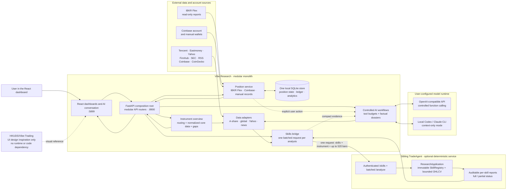

<p align="center"><a href="README.md">简体中文</a> | <b>English</b></p>

<h1 align="center">Vibe-Research · Your Personal AI Research Dashboard (Stocks / Crypto)</h1>

[](LICENSE)
[](https://www.python.org/)
[](https://react.dev/)
[](https://fastapi.tiangolo.com/)
[](https://github.com/simonlin1212/Vibe-Research/stargazers)
[](README.md)

<p align="center">
  <a href="https://viberesearch.wiki">Website</a> ·
  <a href="#screenshots">Screenshots</a> ·
  <a href="#features">Features</a> ·
  <a href="#data-sources">Data Sources</a> ·
  <a href="#quick-start">Quick Start</a> ·
  <a href="#bring-your-own-ai">Bring Your Own AI</a> ·
  <a href="#compliance">Compliance</a>
</p>

> **Vibe-Research: Your Personal Trading Research Agent.**
>
> A self-hosted dashboard for A-share, US, European and Hong Kong stocks plus crypto. It plugs into **your own AI / agent** without recommending a trade.

Vibe-Research is an open-source, self-hosted research dashboard covering A-share, US, European and Hong Kong stocks plus crypto.

It does not make decisions for you. It pulls together quotes, analyst reports, valuation, financials, filings, fund flows and news into one clean dashboard, then leaves an interface where **you plug in your own AI**. The direction and the conclusions come from the model or agent *you* configure.

## Screenshots

**Daily Review** — indices, market breadth, sector fund flows and turnover leaders on one screen, then hand it to your AI


<table>
<tr>
<td width="50%">

**Stock Data** — earnings snapshot, valuation percentile and fund flows in one view


</td>
<td width="50%">

**News Radar** — 108 public feeds across 12 industry tracks, distilled on demand


</td>
</tr>
</table>

---

## Features

| Page | What's in it |
|---|---|
| 📊&nbsp;**Daily&nbsp;Review** | Index quotes · **Global markets** (Dow / S&P / Nasdaq overnight + Hang Seng / HS Tech) · Watchlist quotes · **Short-term sentiment** (consecutive limit-up ladder, seal rate, break rate, promotion rate) · **Market-wide turnover top 20** · Market breadth · Sector fund-flow trends · Sector rotation · One-click AI review |
| 📡&nbsp;**News&nbsp;Radar** | 108 public RSS feeds across 12 tracks · AI-distilled "today's takeaways" · A-share filings and public news linked to your watchlist |
| 🔍&nbsp;**Instrument&nbsp;Data** | Full A-share data plus exchange-aware public/Yahoo market data for US, European, HK and KR securities. Charts come first; US equities can use SEC Company Facts fundamentals and filing-history skills, alongside equity-only `worth-buy-stocks` and the cross-asset price-series skills. |
| ⚔️&nbsp;**Multi-perspective&nbsp;Research** | Two controlled modes: **bull-vs-bear debate** and a **research team** with fundamentals, market-structure and event-risk specialists followed by a neutral lead. Every role shares one factual dossier and deliberately avoids trade instructions. Add multiple pasted notes or TXT / Markdown / text PDF files for one run. The team may explicitly include one open IBKR position, with a separate opt-in for portfolio-wide goals/risk preferences. |
| ⭐&nbsp;**Watchlist** | **Paste a whole batch of tickers at once** (commas, spaces or newlines) · one-screen table (price, change, PE, PB, turnover) · **live quotes toggle** (top right, off by default; refreshes every 3s during trading hours, auto-pauses outside them and when the tab is hidden) · hand the whole list to your AI. Stored locally |
| 🧩&nbsp;**Sectors** | Sector and value-chain skeletons |
| 💼&nbsp;**Portfolio** | Stock / crypto / cash overview · read-only IBKR Flex sync · allocation · flow-adjusted performance and drawdown · P&L calendar · latest contributors · broker reconciliation · automatic trade ledger · per-position candles with cost and execution markers · read-only Coinbase balances and manual crypto wallets · persistent goals and risk preferences. Manual stock records remain in a separate view. |
| 📄&nbsp;**My Reports** | Drag-and-drop your own research PDFs / Word / spreadsheets · auto-filed by industry from the filename · download or delete. **Stored in your local deploy directory only** |
| 📝&nbsp;**Research Notes** | Save AI reviews, takeaways, Q&A, debates and research-team output locally · **reflection audit**: have the AI audit its own reasoning — which claims are backed by data, which are speculation, where the weakest link is, and what to check next |
| 🔌&nbsp;**Bring Your AI** | One controlled AI layer: each entry point declares a workflow prompt, read-only tool allowlist and call budget · subscription CLI (context-only) · API models (controlled function calling) · MCP for external agents · conversations persisted and scoped by page/instrument. |

The whole UI is responsive: phones use an expandable side drawer, while desktop users can fully hide the sidebar. NAS deployments can enable single-user login, revocable HttpOnly sessions and login throttling.

> **Built-in analysis framework**: when your AI analyzes a stock it organizes findings across five dimensions — valuation, fund flows, earnings quality, industry cycle, catalysts and risks. The framework only prescribes *how to read the data*, never what to buy. The direction still comes from your own model.
>
> Limit-up lists and turnover rankings are **objective public data, presented as-is — no recommendation, no prediction**.

## Data Sources

Three public data toolkits are **vendored directly into this repo** — `git clone` and everything works, no extra downloads or wiring.

### A-share full-stack data · AStockData

- Lives in [`a-stock-data/`](a-stock-data/) (v3.6.0). Ten data layers, 47 endpoints, 15 sources, with fallback sources when a primary one gets blocked. [`a-stock-data/SKILL.md`](a-stock-data/SKILL.md) **embeds every call as runnable code** — self-contained, with built-in rate limiting for Eastmoney endpoints.
- **Covers**: quotes / candles / analyst reports / consensus estimates / valuation / historical percentiles / financial statements / filings / Dragon-Tiger list / margin trading / block trades / shareholder counts / dividends / fund flows / lockup expiry / concept sectors / limit-up sentiment / ETF options / investor Q&A / market-wide industry rankings.
- **For agents**: running this repo with Claude Code or similar? Point them at `SKILL.md` — every endpoint has copy-paste ready code. The backend data layer (`backend/astock.py`) is ported from it.
- **Runtime deps**: `pip install mootdx requests pandas stockstats`
- **Upstream**: <https://github.com/simonlin1212/a-stock-data> — the vendored copy is a pinned snapshot and keeps working even if you never update it.

### US / HK data · global-stock-data

- Lives in [`global-stock-data/`](global-stock-data/) (v2.0.3). 13 data layers, 30+ endpoints, 11 sources, no auth required — quotes, candles, technicals, financial statements, fund flows, options (CBOE official chain with full Greeks and 0DTE flow), FINRA short volume, and the SEC EDGAR filing stream plus market-wide screener. Every source is labeled with its compliance tier.
- `backend/gstock.py` ports the Eastmoney-domain subset: global indices (the "Global markets" row on Daily Review) plus US/HK quotes and key financials.
- **Korean stocks**: append `.KS` to the 6-digit code (e.g. Samsung `005930.KS`). ⚠️ KR codes are also 6 digits like A-share tickers, so **the suffix is required** for correct routing. Quotes only, no financials. Taiwan is covered via US ADRs (e.g. `TSM`).
- **Upstream**: <https://github.com/simonlin1212/global-stock-data>

### Global news · investment-news

- 108 public RSS feeds across 12 industry tracks, merged into `backend/newsradar.py`. Standard library only, no API keys.
- **Upstream**: <https://github.com/simonlin1212/investment-news>

### US fundamentals, filings, and company news

- **SEC EDGAR:** TradeAgent's `fundamental` and `filings` skills use typed Company Facts and submissions providers with filed-date provenance. Set `VR_SEC_USER_AGENT`; also set `TRADE_RESEARCH_FUNDAMENTAL_PROVIDER=sec_company_facts` when launching through Compose (the local launcher selects it automatically). The skill catalog reports unconfigured capabilities instead of presenting them as runnable.
- **Company news:** Finnhub is preferred when `VR_FINNHUB_API_KEY` is configured. Otherwise the app uses an explicitly labelled Yahoo Search best-effort fallback adapted from the Vibe-Trading data-tool pattern, with provider, freshness, degradation-gap, and stale-cache metadata.
- Yahoo Search does not promise complete coverage, and it never substitutes for Finnhub-only earnings data.

> All data comes from public sources. Vibe-Research only performs objective data aggregation and presents public rankings as-is — **it does not recommend stocks, predict price moves, time trades, or assign subjective scores**. What you do with the data is up to you and your AI.

## Architecture

The application is a **modular monolith**: one React client, one FastAPI process,
one local SQLite database, and one optional deterministic-analysis service. This
keeps local deployment simple while preserving clear module boundaries.

```
Vibe-Research/
├── a-stock-data/      A-share data toolkit (vendored v3.6.0, ready to use)
├── global-stock-data/ US / HK data toolkit (vendored v2.0.3, ready to use)
├── backend/           FastAPI :8900
│   ├── app.py           Composition root, middleware and health only
│   ├── api/             Routers grouped by product concern
│   ├── instrument_overview.py  One normalized instrument read model
│   ├── astock.py        A-share data
│   ├── gstock.py        US / HK data
│   ├── newsradar.py     News radar
│   ├── market.py        Market breadth + sector fund flows + global indices
│   ├── position_store.py Shared SQLite position-state store
│   ├── portfolio.py     Manual portfolio and closed positions
│   ├── ibkr_*.py        IBKR Flex import, analytics ledger and executions
│   ├── crypto_*.py      Coinbase/manual wallets and cross-asset aggregation
│   ├── auth.py          Optional single-user login and revocable HttpOnly sessions
│   ├── tools.py         Shared read-only AI tool registry
│   ├── ai_workflows.py  Workflow prompts, tool allowlists and call budgets
│   ├── chat.py          Controlled API function calling / local CLI runtime
│   ├── debate.py        Bull-vs-bear orchestration (dossier → bull / bear / moderator)
│   ├── research_team.py Specialist team orchestration (3 specialists → neutral lead)
│   ├── research_context.py  Bounded transient TXT / MD / PDF context extraction
│   ├── reflection.py    Reflection audit (audits reasoning in existing analysis)
│   └── mcp_server.py    MCP server (for Claude Code and other agents)
└── frontend/          Vite + React 19 + TS + Tailwind :5899
```

### Runtime architecture and TradeAgent boundary



| Concern | Owner and data flow |
|---|---|
| Data sources | Vibe adapters fetch provider data. `instrument_overview.py` owns market routing and returns normalized core data, capabilities and explicit gaps, so React does not encode provider rules. Short-lived quote/history caching reduces repeated provider calls and can serve the last good value during a transient outage. |
| AI conversation | Vibe selects a fixed English canonical prompt, limits read-only tools and rounds, builds a factual dossier, and streams the configured API/CLI model response. Locale is an output instruction/translation layer, not a second prompt implementation. |
| Analysis dashboards | React uses typed APIs. The instrument page makes one cancellable core request, renders it immediately, then loads optional news, earnings and filings without blocking the chart. |
| Positions | Vibe imports IBKR Flex and Coinbase read-only data and combines optional manual records. Mutable position state, the transaction ledger and analytics share one SQLite database; legacy JSON is imported once only. Holdings enter AI context solely after an explicit user action and are never sent to TradeAgent. |
| Skills | Vibe prepares the instrument and OHLCV once and sends all selected skills in one `/analyze` request. TradeAgent validates the bounded payload and returns auditable full/partial reports. It has no broker, order, position, or LLM responsibility. |

The dependency direction is intentionally one-way: **Vibe Research may call
TradeAgent, but TradeAgent does not call back into Vibe Research**. This keeps
the reusable analytics engine independent of the product UI, personal data,
broker connections, and model provider. AI workflows may quote compact skill
results as evidence, but they cannot change skill calculations or submit orders.
The similarly named `HKUDS/Vibe-Trading` project is not this sibling service:
Vibe Research credits its visual language only and does not import or call it.

This boundary is deliberately the only extra process. Splitting data adapters,
positions, AI workflows, or routers into separate services would add deployment,
network and consistency costs without improving the current single-user product.
The module boundaries provide expansion points inside the monolith; extract a
service only if independent scaling or a separately owned deployment becomes a
measured requirement.

**Tiered dependencies**: quotes (Tencent) and reports/filings (Eastmoney) work with a minimal install. `akshare` / `mootdx` are imported lazily — if missing, only those endpoints return 501 with an install hint; the service still runs.

## Quick Start

### Option A: local all-in-one launcher

With `TradeAgent` and `VibeResearch` checked out as sibling directories and
their virtual environments installed. TradeAgent supplies the read-only
`worth-buy-stocks`, `markov-method`, `technical-basic`, `risk-analysis`, and
`volatility-regime` Skills. IBKR holdings and analytics run directly inside
Vibe; **PA Master is not required**.

```bash
cd /Users/chenkangan/Documents/VibeResearch
bash scripts/start-local-stack.sh
```

Open <http://127.0.0.1:5899>. The launcher starts only TradeAgent, the Vibe
backend and the Vibe frontend; it does not start or call PA Master. Press
`Ctrl-C` in the launcher terminal to stop all services.

### TradeAgent Skills

Vibe owns instrument selection, normalized market-data loading, AI entry points,
and report presentation. Deterministic analytics run in the sibling TradeAgent
service. Price skills use a strict instrument contract (`symbol` + `market`) and
up to 520 daily OHLCV bars. US fundamental and filing skills use TradeAgent's
existing typed SEC providers, so provider payloads are not copied into the UI
bridge. Crypto daily bars come from Coinbase and retain fractional volume.

| Skill | Equities | Crypto | Primary inputs and outputs |
|---|---:|---:|---|
| `fundamental` | US | — | Point-in-time SEC growth, margins, cash flow, leverage, and available valuation factors |
| `filings` | US | — | SEC filing counts, 8-K activity, and 10-K/10-Q recency |
| `worth-buy-stocks` | Yes | — | Trend, relative strength, risk vetoes, and reference levels |
| `markov-method` | Yes | Yes | Bull/Bear/Sideways state, transition matrix, and stationary distribution |
| `technical-basic` | Yes | Yes | EMA, ADX/DMI, RSI, Bollinger Bands, OBV, and volume confirmation; complete OHLCV required |
| `risk-analysis` | Yes | Yes | Volatility, downside deviation, drawdown, historical VaR/CVaR, and return shape |
| `volatility-regime` | Yes | Yes | 20-day realized volatility, historical percentile, and expansion/contraction state |
| `backtesting` | Yes | Yes | Daily long/flat SMA, MACD, RSI, and Markov tests with fills, equity curves, and metrics |

The dedicated `/backtesting` playground owns backtest controls and charts; the
skill is intentionally absent from the generic instrument-page skill picker.
Skill cards, tables, chart axes, and tooltips display two decimal places. The
collapsible Raw JSON keeps original precision for auditing. Missing fields or
insufficient history remain explicit TradeAgent partial results; Vibe does not
fabricate substitutes.

To use real read-only positions locally, create the Git-ignored `.env.local`
file (preferred; the launcher also falls back to the root `.env`):

```bash
export VR_IBKR_FLEX_TOKEN='your_flex_token'
export VR_IBKR_FLEX_QUERY_ID='your_positions_query_id'
export VR_IBKR_FLEX_HISTORY_QUERY_ID='your_history_query_id'
export VR_IBKR_FLEX_TIMEZONE='Europe/London'
export VR_IBKR_FLEX_COOLDOWN_SECONDS='300'
export VR_IBKR_FLEX_INTER_QUERY_DELAY_SECONDS='5'
```

The launcher passes the settings to Vibe's direct IBKR holdings and analytics
panel. The history query is optional; when configured, “Refresh current +
history” normally spaces the two reports by 5 seconds. If IBKR reports statement
generation (1001/1019) or pacing (1018), Vibe waits 15 or 60 seconds and retries
once. A successful normal refresh therefore has no fixed one-minute wait. No orders are submitted.
Local snapshots and the analytics ledger persist under `~/.vibe-research` by
default. If the launcher falls back to a Docker-oriented `.env`, container-only
`/data` paths are safely replaced; use `VIBE_LOCAL_DATA_DIR` to override this.

The launcher prints the exact `vibe-backend.log` path. IBKR diagnostics record
only the request stage, HTTP metadata, response size/fingerprint, and retry
count—never the token, query ID, account IDs, or raw statement. Error `1001`
is retried with backoff while preserving the last valid snapshot; `1018` means
the pacing cooldown must elapse before another refresh.

To inspect Flex queries without writing the Vibe snapshot, make sure no app
refresh is running and use:

```bash
bash scripts/test-ibkr-flex.sh current
bash scripts/test-ibkr-flex.sh history
# Or inspect both with the pacing delay applied automatically:
bash scripts/test-ibkr-flex.sh all
```

The command prints only section counts, report dates, and a sanitized response
shape. A current query needs `OpenPosition`; historical analytics need
`ChangeInNAV`, `MTMPerformanceSummaryUnderlying`, and `Trade`.

### Option B: Docker Compose

For a UGREEN NAS without Compose terminal access, use the dedicated
[Mac-build and UGOS Docker Project guide](docs/nas-full-stack-deployment.md).
It cross-builds `linux/amd64` images on the Mac, exports one image tar, and uses
an image-only Project on the NAS; no NAS-side source build is required.

Create a Git-ignored `.env` beside `compose.yaml` with the same
`VR_IBKR_FLEX_*` values, then run:

```bash
cd /Users/chenkangan/Documents/VibeResearch
docker compose up -d --build backend frontend
```

Open <http://127.0.0.1:8080>. Use `docker compose ps`,
`docker compose logs -f backend`, and `docker compose down` for operations.
To start the optional TradeAgent research service, first build the sibling repo
and enable the bridge in `.env`:

```bash
docker build -t trade-research:latest ../TradeAgent
# Set VR_TRADE_RESEARCH_ENABLED=true and VR_TRADE_RESEARCH_API_TOKEN in .env
# Set VR_SEC_USER_AGENT and TRADE_RESEARCH_FUNDAMENTAL_PROVIDER=sec_company_facts for SEC skills
COMPOSE_PROFILES=research docker compose up -d --build
```

The same `VR_TRADE_RESEARCH_API_TOKEN` is passed to both services. Do not run
the local launcher and Compose simultaneously.

### Phone / LAN access

The all-in-one launcher binds to `127.0.0.1` by default. For phone testing,
stop it, start the backend using the manual mode below, and expose only the
development frontend to the LAN:

```bash
cd frontend && npm run dev -- --host 0.0.0.0 --port 5899
```

On macOS, run `ipconfig getifaddr en0` to find the Wi-Fi address, then open
this from an iPhone on the same Wi-Fi:

```text
http://<Mac LAN IP>:5899
```

For example, `http://192.168.1.128:5899/portfolio`. If it cannot connect, allow
Node/Vite through the macOS firewall and make sure guest-Wi-Fi isolation or a
VPN is not separating the devices. LAN HTTP is for testing only. For a NAS or
cross-network deployment, use HTTPS through a reverse proxy or Tailscale Serve
and enable login protection.

### NAS / remote login protection

Generate an Argon2id password hash and enable the browser login in `.env`:

```bash
docker compose run --rm backend python auth.py hash-password
```

```env
VR_AUTH_ENABLED=true
VR_AUTH_USERNAME=admin
VR_AUTH_PASSWORD_HASH='$argon2id$...'
VR_AUTH_COOKIE_SECURE=true
VR_PUBLIC_ORIGIN=https://research.example.com
```

Keep the hash in single quotes so Compose does not interpolate `$` characters.
Use `VR_AUTH_COOKIE_SECURE=true` only behind HTTPS; leave it `false` for plain
LAN HTTP tests. Never expose port 8900, TradeAgent or the database directly.
See [`backend/README.md`](backend/README.md) for password reset and session details.

### Manual two-process mode

For a minimal setup, source `.env.local` (if used) in two terminals:

```bash
# terminal 1
cd backend && .venv/bin/python -m uvicorn app:app --host 127.0.0.1 --port 8900

# terminal 2
cd frontend && npm install && npm run dev -- --host 127.0.0.1 --port 5899
```

## Bring Your Own AI

Configure once on the "Bring your AI" page and every AI feature across the dashboard uses your model. **All analysis comes from your model — this project does not tune or bias it.** Each entry point selects an explicit workflow that controls its startup prompt, read-only tool allowlist and maximum tool rounds. Three options:

### 1. Subscription mode (uses a CLI you're already logged into — no API key)

Uses your existing subscription instead of paying per API call. Supported: **Claude Code · Codex · Qwen Code · DeepSeek CLI**.

- **Requirements**: the backend runs on your own machine, and the CLI is installed, logged in and on your `PATH`.
- Pick one on the "Bring your AI" page — no key needed.
- ⚠️ CLIs answer in one shot without multi-step tool calls, so this suits flows where the data is already prepared (daily review, takeaways, asking about the stock currently on screen). For open-ended questions where the AI should fetch data itself, use API mode.

### 2. API mode (bring your own key)

Pick a model and the base URL is filled in for you — just paste the key. Built-in presets for **DeepSeek / Doubao / MiniMax / OpenAI / OpenRouter / Groq / Together / MiMo / any OpenAI-compatible endpoint**. This mode supports function calling, but only through the selected workflow's Vibe tool allowlist. Your key stays in your browser's local storage and is sent only to your own backend.

There is currently no general web-search or private-knowledge-base tool. Future Web Search or Obsidian integrations should be added as separate read-only tools and enabled only for workflows that need them.

### 3. MCP (for Claude Code and other agents)

Mount the backend as an MCP server so your agent can call Vibe-Research's data tools with its own subscription. See [`backend/README.md`](backend/README.md).

## How the Multi-Agent Part Is Designed

Open-source multi-agent finance frameworks (TradingAgents, ai-hedge-fund and friends) end their pipeline with a trader or portfolio_manager role that outputs "buy / sell / how much". **This project deliberately omits that layer.**

The page provides two deliberately small multi-agent workflows with the same safety boundary.

### Research team

```
1. Factual dossier    backend fetches objective data once
2. Three specialists fundamentals / market structure / event risk
3. Neutral lead       evidence, conflicts, missing data and verification checklist
```

The team can include one explicitly selected open IBKR position. Before a run,
the UI previews the exchange-aware symbol, quantity, cost, mark, unrealized P&L,
NAV weight and snapshot date. Other positions are not included implicitly.
Portfolio-wide investment goals and risk preferences have their own switch and
are off by default, so they are sent only when relevant to the position.

Both the debate and research team can explicitly multi-select approved
TradeAgent skills. The current selection can be saved as separate equity or
crypto defaults. Defaults are only preselected and can still be removed or
extended for an individual run; unselected skills are not executed. They are
stored under `VR_DATA_DIR`, so they survive restarts and apply to other devices
using the same deployment. Vibe prepares market data once, computes each selected skill once, and
adds the identical read-only result to the shared dossier; for example,
`technical-basic` becomes common technical evidence for both bull and bear
roles. Controlled API-model workflows can also call the `run_research_skill`
Vibe Method when needed. The allowlist, asset-type checks and exchange-aware
symbols still apply, no orders are executed, and CLI providers remain
context-only rather than calling tools themselves.

### Multiple supplemental contexts

Both modes accept up to eight pasted notes or UTF-8 TXT, Markdown and
text-extractable PDF files. Limits are 10MB per file, 25MB per upload batch,
20,000 characters per item, 50,000 characters total, and 50 pages per PDF.
Files are extracted in memory for the current run and are not written to the
report library or data directory; scanned PDFs do not currently use OCR.
Supplemental material is marked unverified, document instructions are treated
as untrusted, and the model is told to cite the material by name.

### Bull-vs-bear debate

Here the endpoint is **disagreement**, not a verdict:

```
① Factual dossier   backend pulls 13 objective datasets (no LLM involved)
                     ↓  both sides argue over the same data — nobody can win by making numbers up
② Bull researcher   builds the case: thesis + supporting evidence + what must hold for it to work
③ Bear researcher   builds the counter-case: doubts + risk evidence + what must hold for it to work
   (optional)       rebuttal round: address each point, concede what's conceded, refute with data
④ Neutral moderator shared ground / real disagreements (missing data or differing reads?) /
                     what to verify / what data is absent
```

Deliberate constraints:

- **Dossier first** — the model isn't left to remember which tool to call. Data is deterministic and reproducible; missing items are stated in the dossier with an explicit "do not speculate" instruction.
- **Every claim must cite the specific data it rests on**; anything unsupported must be labeled as such.
- **The moderator does not pick a winner** and gives no rating or lean — its output is "here's what to look at next".
- Rate-limited endpoints are fetched **serially**: the throttle is timestamp-based rather than lock-based, so concurrency would blow straight through it.

### What one debate costs (read before you run it)

A debate is much heavier than a chat — it runs a full pipeline and **every role carries the complete dossier**. Measured:

| | 1 round | 2 rounds (with rebuttal) |
|---|---|---|
| Model calls | **3** | **5** |
| Input sent | ~35k CJK chars | ~60k |
| Output | ~4k | ~7k |
| Wall clock | **~100–120s** | ~3 min |

Roughly 35s of that is fetching the dossier — a dozen public endpoints, **zero tokens**. The rest is generation.

**To keep costs down:**

1. **One round is usually enough.** Two rounds doubles everything.
2. **Prefer subscription mode** (local CLI) over an API key.
3. **A debate doesn't need an expensive model.** The data is already in the dossier; the model only organizes and expresses it. Save your budget for your own deep questions.
4. **Don't spam it.** The dossier hits a dozen throttled endpoints.

### Reflection audit

The same idea applied to writing you already have: audit the reasoning and surface the parts that *sound* reasonable but aren't backed by anything. In testing it reliably catches things like "widely recognized by institutions" (generalizing from three data points) or "frequently raised estimates" (never quantified).

Much cheaper — **a single model call** over the text you selected.

## Tests

```bash
# Backend
cd backend && .venv/bin/pip install -r requirements-dev.txt
.venv/bin/pytest -m "not live"   # offline unit + API tests (fast, no network)
.venv/bin/pytest -m live         # verifies live data source shapes (run before releases)

# Frontend
cd ../frontend
npm test
npm run build

# Startup and deployment configuration
cd ..
bash -n scripts/*.sh
docker compose config --quiet
```

## Compliance

- Objective data aggregation and public-ranking display only: **no stock recommendations, no price predictions, no trade timing, no return promises, no subjective scoring.** Neutral by design.
- Limit-up lists and turnover rankings are **objective public data** (the same numbers Eastmoney and Tonghuashun publish); the product displays them as-is with nothing attached.
- All analytical direction comes from the AI *you* configure, not from this project. There are no buy/sell buttons in the UI, and valuation percentiles mark position only — no lines suggesting when to act.
- **Your portfolio, watchlist, uploaded reports and API keys stay on your machine and out of the repository.** When you explicitly run an AI workflow, only that workflow's visible context is sent to the model endpoint you configured. Research-team supplemental files are not persisted by Vibe.
- Portfolio and uploaded reports default to `~/.vibe-research/` (override with `VR_DATA_DIR` / `VR_REPORTS_DIR`) — outside the project folder, so re-downloading or overwriting the project never loses your data.

## Related Projects

All from the same open-source stack ([`simonlin1212`](https://github.com/simonlin1212)):

| Repo | What it is |
|---|---|
| [**a-stock-data**](https://github.com/simonlin1212/a-stock-data) | A-share full-stack data toolkit (10 layers · 44 endpoints · 15 sources) — this project's A-share engine |
| [**global-stock-data**](https://github.com/simonlin1212/global-stock-data) | US / HK full-stack data toolkit (13 layers · 30+ endpoints · 11 sources) |
| [**investment-news**](https://github.com/simonlin1212/investment-news) | Global industry news dashboard (12 tracks mapped to A-share sectors) |
| [**Agent-Staff**](https://github.com/simonlin1212/Agent-Staff) | Agentify a company: one AI agent per department plus a chief-of-staff |

## Contact

Built by **Simon**, independent developer.

- 🐦 X: [@linsizhen](https://x.com/linsizhen)
- ✉️ Email: <simonlin0423@gmail.com>
- 💬 Happy to talk about **enterprise AI adoption**; for project issues please open an [Issue](https://github.com/simonlin1212/Vibe-Research/issues).

## Acknowledgements

- A-share data engine: [a-stock-data](https://github.com/simonlin1212/a-stock-data)
- US / HK data engine: [global-stock-data](https://github.com/simonlin1212/global-stock-data)
- News: [investment-news](https://github.com/simonlin1212/investment-news)
- UI design language referenced with thanks: [HKUDS/Vibe-Trading](https://github.com/HKUDS/Vibe-Trading) (UI inspiration only; the implementation here is separate)

## Disclaimer

This project is for learning and research purposes and **does not constitute investment advice**. The dashboard performs objective data aggregation and displays public rankings — it does not recommend stocks, predict price movements, time trades, or promise returns. All analytical conclusions come from the AI you configure yourself and have nothing to do with this project. Markets carry risk; verify independently and decide for yourself.

## Support

If this tool saved you time, a coffee is appreciated.

<p align="center">
  <a href="https://buymeacoffee.com/simonlin1212"></a>
</p>

## License

MIT
